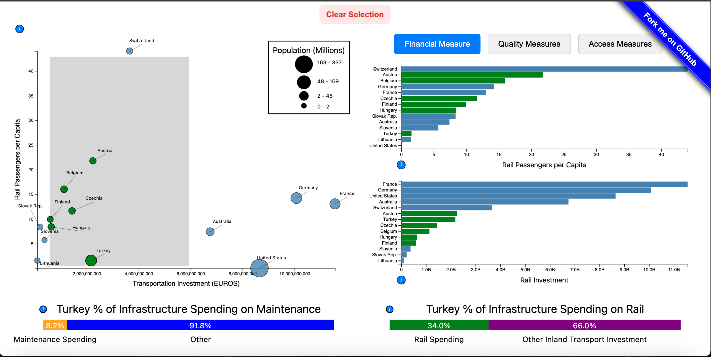

# Project Team 23: Public Transportation Systems Efficiency Analysis, COSI 116A F23

An interractive data visualization using D3.v4 and javascript that explores various countries spending patterns on railway systems compared to the usage of those systems. This includes various quality measures and spending breakdowns as well. The final webpage additionaly contains a description, analysis, and walk through of the visualization and creation process. This visualization will run both on chrome and firefox. 

## Running the Visualization
See the published version here: 
https://cosi116a-brandeis-infovis-fall23.github.io/graduate-team-23-transportation-systems/

OR

Clone locally and run using a python webserver:
* `python -m http.server 8000`
* `python3 -m http.server 8000`
* `py -m http.server 8000`
If you are using Python 2 you will need to use `python -m SimpleHTTPServer 8000` instead, but please switch to Python 3 as [Python 2 was sunset on 2020.01.01](https://www.python.org/doc/sunset-python-2/).

Wait for the output: `Serving HTTP on 0.0.0.0 port 8000 (http://0.0.0.0:8000/)`

Now open your web browser (Firefox or Chrome) and navigate to the URL: http://localhost:8000

## Root Files
* `README.md` is this explanatory file for the repo.

* `index.html` contains the main website content. This contains sections for:
    * `Motivation`
    * `Visualization` - both a description and the actual D3 implementation
    * `Visualization Explaination` - a video walkthrough
    * `Data Analysis`
    * `Task Aanalysis`
    * `Design Process` - including a description, prototypes, and initial sketches
    * `Conclusion`
    * `Acknowledgements`

* `style.css` contains the CSS.

* `LICENCE` is your source code license.

## Folders
Each folder has an explanatory `README.md` file

* `data` is where our data is in a json file. data/README.md contains the sources for this data. It was compiled using google sheets due to the small size of our dataset and small amount of overlapping data. 

* `favicons` contains the favicons for the course projects. You shouldn't change anything here.

* `files` will contain your slides (PDF) and video (MP4).

* `images` will contain your screenshots, diagrams, and photos.

* `js` will contain all JavaScript files you write.

  * `visualization.js` is the main code that builds all of our visualization and facilitates brushing and linking.
  * `scatterplot.js` contains the main scatterplot structure to compare infrastructure spending to rail usage. 
  * `inlandRail.js` creates the popup bar when a point on the scatterplot is clicked, with percentages of inland transport spending that is dedicated to rail.
  * `countryBar.js` creates another popup bar when a point on the scatterplot is clicked. It contains the percentage of rail investment goes to maintenence.
  * `countryBarGraphs.js`is a template for the bar graphs next to the scatterplot. These show the rankings of each country for various measures.
  * `imageCarousel.js` creates the image carousel in the prototypes section to show various sketches we made without taking up too much space. 
  * `toggleGroups.js` an extra javascript file to be called when switching between groups of bar graphs depending on the type of data that you are trying to view. Essentially functionality for certain buttons.

  
* `lib` will contain any JavaScript library you use. It currently includes D3.

    